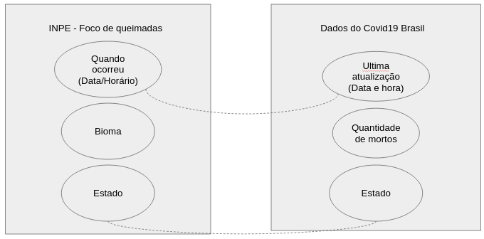

## Tarefa 1 sobre APIs de acesso
[Notebook](https://github.com/andreytdl/Analise-de-Dados/blob/master/lab01/notebook/Dado%20de%20queimadas%20pelo%20INPE.ipynb)

## Tarefa 2 sobre Engenharia Reversa
A ideia é comparar os dados de queimadas e através de uma análise poder determinar se o numero de mortes por problemas respiratórios aumentou devido a uma soma entre queimadas e o coronavirus. 

<h2>Dados utilizados:</h2>
<h3>Api de queimadas do INPE</h3>
<b>Quando ocorreu:</b> Futuramente poderá ser usado em conjunto com os dados do coronavirus para determinar se os acontecimentos realmente podem ter alguma relação. 
<b>Bioma:</b> Podemos verificar também se possíveis diferenças nos dados são devido a vegetação local 
<b>Estado:</b> Utilizaremos em conjunto com os dados do coronavirus para a verificação da região de incidente. 
<h3>Dados do Covid19</h3>
<b>Ultima atualização:</b> Futuramente poderá ser usado em conjunto com os dados dos focos de queimada para determinar se os acontecimentos realmente podem ter alguma relação. 
<b>Quantidade de mortos:</b> Dado essêncial para determinar-mos se houve ou não alguma alteração nos acontecimentos. 
<b>Estado:</b> Utilizaremos em conjunto com os dados dos focos de queimada para a verificação da região de incidente. 
<h3>Documentações</h3>
<a href="http://queimadas.dgi.inpe.br/queimadas/dados-abertos/apidoc/"> Queimadas INPE </a> 
<a href="https://covid19-brazil-api-docs.now.sh/"> Api Covid19 </a>
