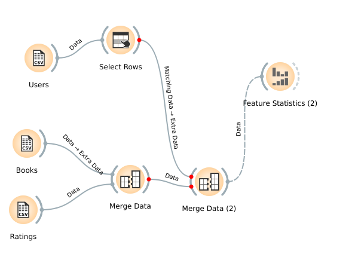

## Lab 03 -> Trabalhar com grandes quantidades de dados e analizar seus relacionamentos a partir do software Orange

 
<h2> Ideia Inicial </h2>
 
Minha ideia inicial foi, a partir dos dados de livros, leitores e avaliações dos leitores verificar se a idade dos leitores iria influenciar em seus votos ou não. A ideia era verificar se leitores mais jovens iriam preferir livros mais recentes aos mais antigos e realizar a mesma verificação com os leitores mais velhos.
 
 
<h2> Ideia final </h2>
 
Infelizmente, embora as planilhas fossem grandes em quantidade de dados eu não pude realizar a minha análise da ideia inicial devido a pouca diversidade nos dados, em relação principalmente ao campo amostral das idades.
 
Dos dados coletados e das combinações entre as tabelas eu pude destacar que de todos os leitores do nosso campo amostral a maioria detesta ler ou detesta tudo que lê, pois a maioria votou nota zero nos livros que leu. Segue os dados de votação:

